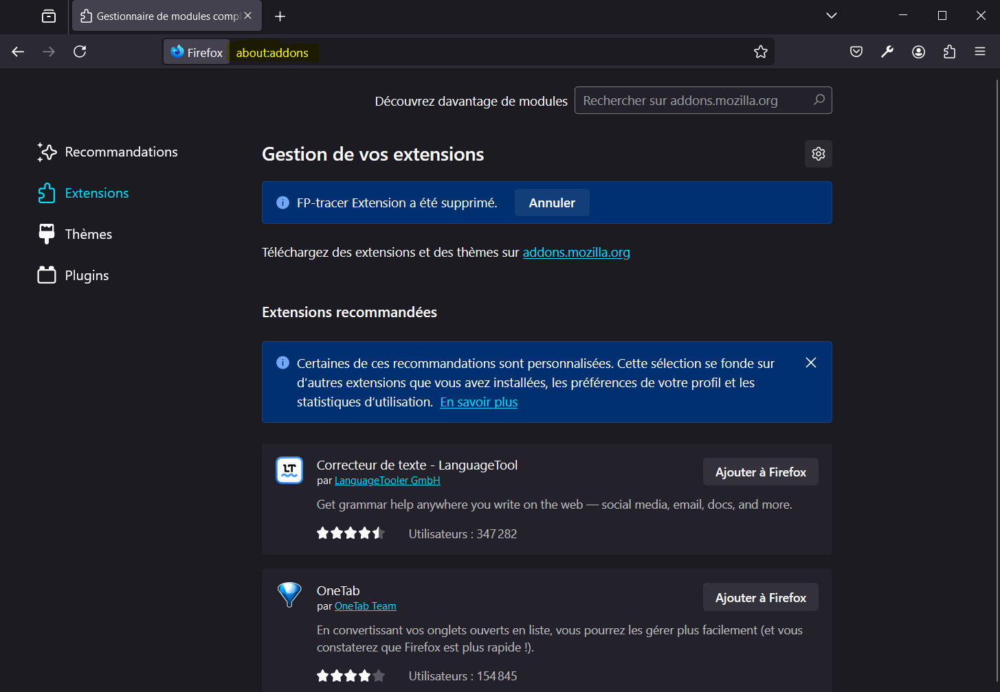
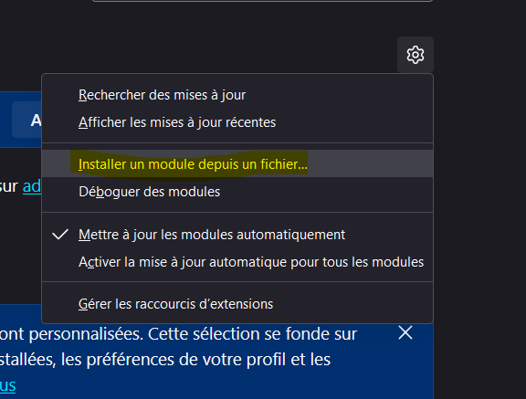
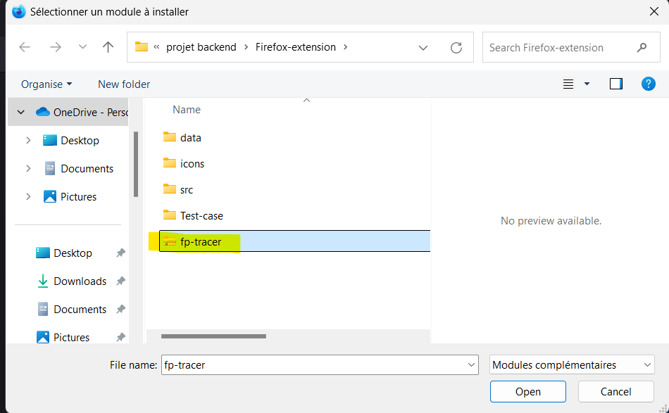
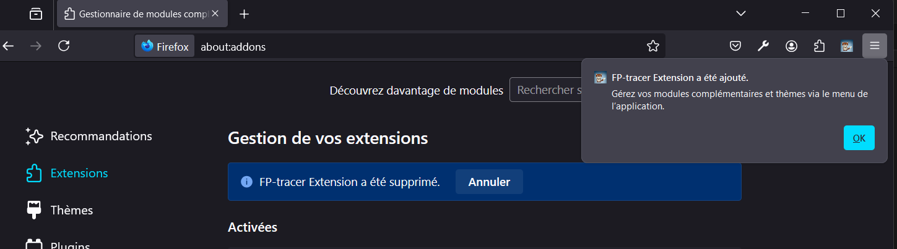
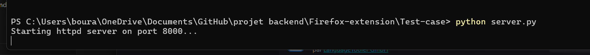

# Firefox Extension Crawler

This script automates the process of visiting multiple websites using Firefox with a custom profile that includes our extension. It's designed to help test our Firefox extension across various websites.

## Prerequisites

- Python 3.x installed on your system
- Selenium WebDriver for Python (`pip install selenium`)
- Firefox Developer edition browser installed
- GeckoDriver executable (Firefox WebDriver)

## Setup

1. Install the required Python package:

```pip install selenium```


2. Download GeckoDriver from [Mozilla's GitHub repository](https://github.com/mozilla/geckodriver/releases) and place it in a known location on your system (choose the right executable for your OS).

3. Create a Firefox profile with your extension installed:
- Open Firefox developer edition and go to `about:profiles`
- Create a new profile ( or use the default one)
----
There is 2 methods to enable adding the extension :
First one :
- Access the Configuration Settings:
- Type about:config in the address bar and press Enter.
- You’ll see a warning about potentially voiding your warranty. Click on "Accept the Risk and Continue."
  Disable Signature Requirement:
- In the search bar on the about:config page, type xpinstall.signatures.required.
- Double-click on the xpinstall.signatures.required preference to set it to false.
Second one :
- Go to your Firefox profile directory (usually located at ~/.mozilla/firefox/ on Linux or %APPDATA%\Mozilla\Firefox\Profiles\ on Windows).
- Create a file named user.js.
- Add the following line to user.js:
```bash
user_pref("xpinstall.signatures.required", false);
```
----

- Install your extension in this profile (zip all files)
- Note down the path to this profile (you can find it in `about:profiles`)
- usually in linux it's in : /home/user/.mozilla/firefox/profile-name...
- in windows : you find it in : %appdata%/Mozilla/profiles/....

4. Prepare a text file with a list of URLs to visit, one per line.

## Usage

1. Open a terminal or command prompt.

2. Navigate to the directory containing the script.

3. Run the script:

```python automate.py```


4. When prompted, enter the following information:
- Path to the text file containing the list of URLs
- Path to the Firefox profile with your extension installed
- Path to the GeckoDriver executable

5. The script will then:
- Open Firefox with your custom profile
- Visit each URL in the list
- Wait for 15 seconds on each page
- Close the browser after visiting all URLs

## Troubleshooting

- If you encounter a `WebDriverException`, check that the paths to your Firefox profile and GeckoDriver are correct.
- Ensure that your Firefox profile has the necessary permissions to run automated tests.
- If websites are loading too slowly, you may need to increase the wait time (currently set to 15 seconds) in the script.

## Customization

- You can modify the wait time by changing the `time.sleep(15)` line in the script.
- To handle specific websites differently, you can add conditional logic within the `for` loop that visits each link.

## Note
Don't forget to uncomment the LognewVector function in content.js and to lunch server.py with ```python server.py```
This script is designed for testing purposes. Be mindful of the websites you're visiting and respect their terms of service .






